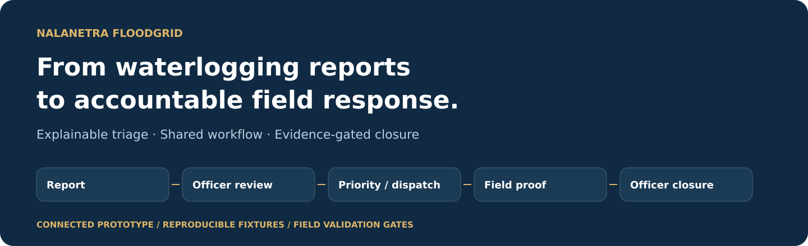
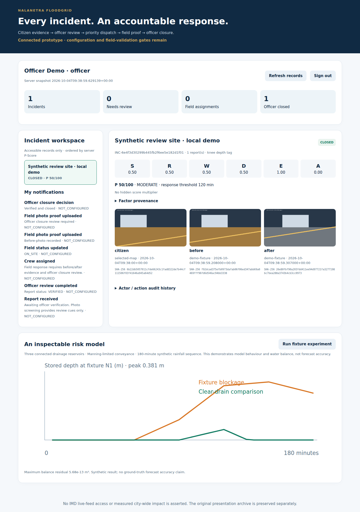
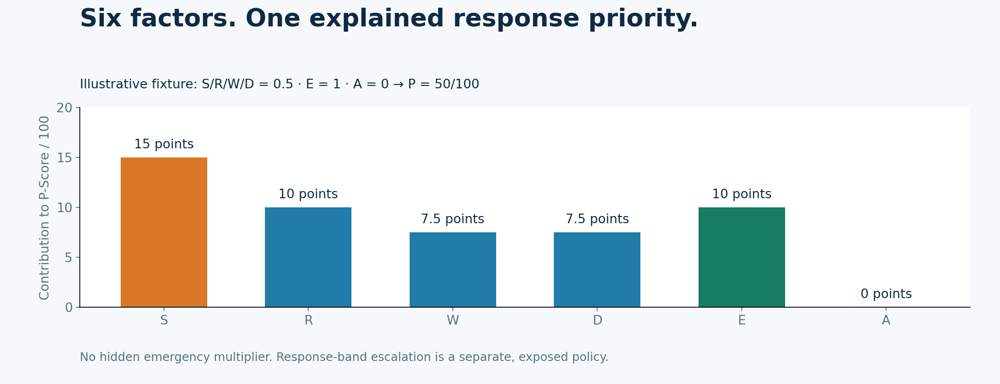
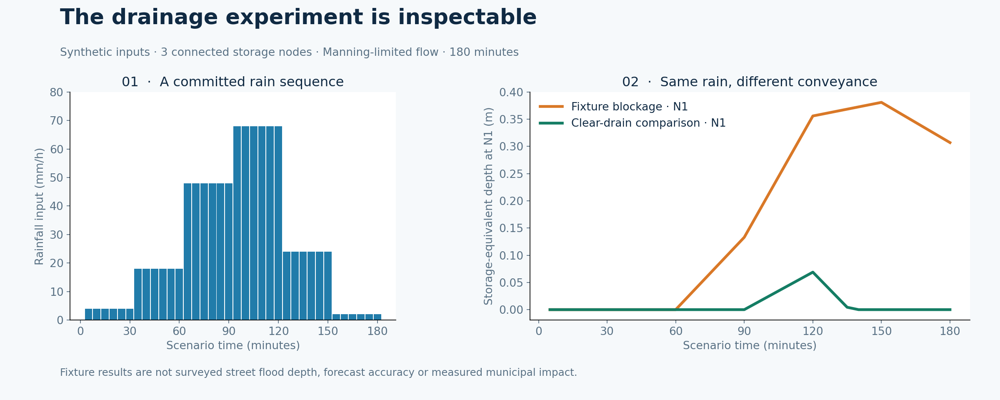
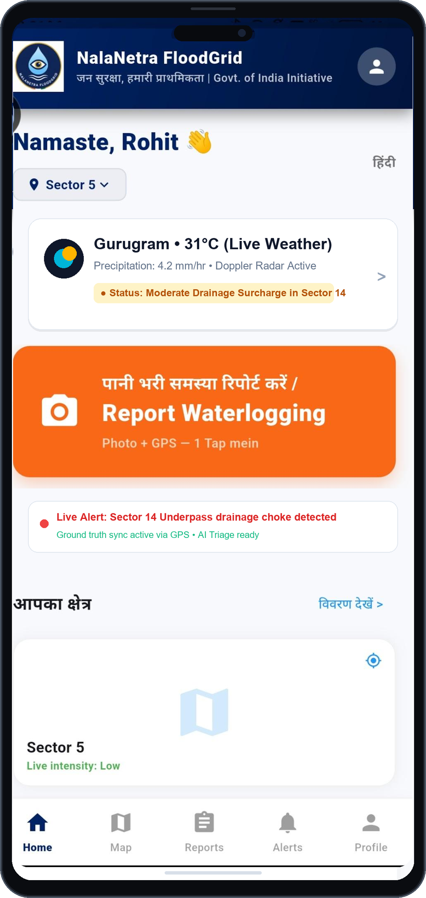
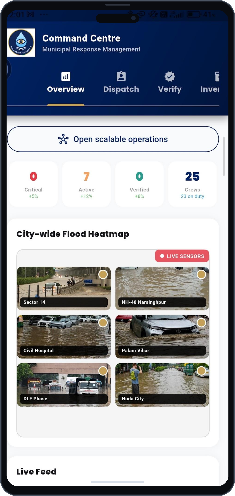
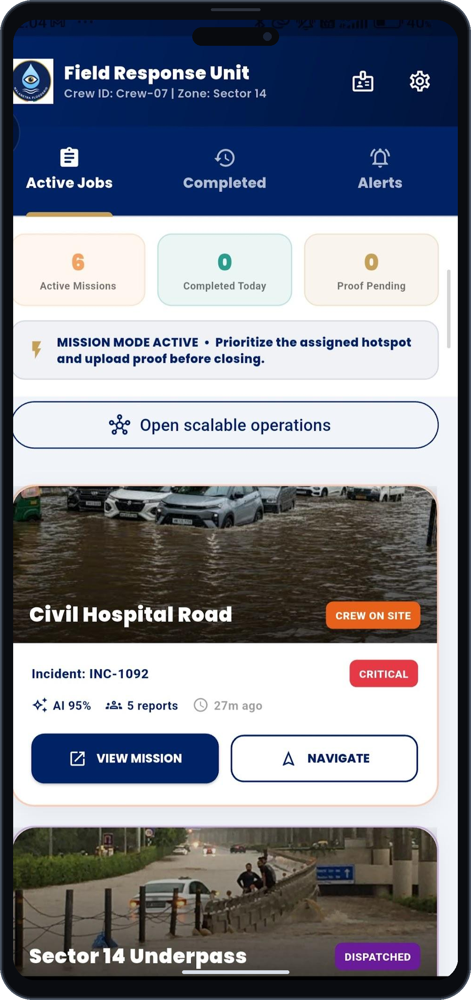

<p align="center"></p>

[](https://github.com/Rohi56u/NALANETRA-FLOODGRID-/actions/workflows/verify.yml)


**A citizen flood report becomes an accountable municipal response—with an explained priority, an assigned crew and officer-reviewed photo evidence.**

NalaNetra FloodGrid connects citizen reporting, MCG officer triage and field response in one persisted workflow. Its drainage experiment explores how rainfall and reduced conveyance change local storage. The project focuses on urban waterlogging and municipal response in Gurugram.

**Submission context:** Smart India Hackathon 2026 · PS26085 · Team Flood Busters · Team ID 144020. The submitted presentation is preserved unchanged; this repository records the behavior and validation of the current build.

[**Start the demo**](docs/SETUP.md) · [**Five-minute review**](docs/REVIEWER_GUIDE.md) · [**Architecture**](docs/ARCHITECTURE.md) · [**Validation**](docs/VALIDATION.md) · [**Team walkthrough**](https://youtu.be/GUJLAIAJF2g) · [**Submitted PDF**](docs/slides/PS26085_FLOOD_BUSTERS.pdf)

## What a reviewer can run

| Role | Working capability | Evidence in the implementation |
|---|---|---|
| Citizen | Hindi/English reporting, photo and location, account-owned retry queue, ticket updates | Original image bytes, capture time and stable retry ID reach the API; acknowledgement requires server record IDs |
| MCG officer | Incident point map, explained priority queue, photo review, explicit duplicate merge, issued crew dispatch | Review and state changes record the actor/time; an unverified report cannot be dispatched |
| Field crew | Assigned mission, GPS arrival check, fresh before/after capture, route request | Assignment, distance, claimed GPS accuracy, capture age and image reuse checks run on the server |
| Officer overview | Actual incident counts, completed fraction, status updates and experiment view | Values come from the same role-scoped database snapshot; city overview is an officer view |

A lightweight browser console runs alongside the Flutter client and uses the **same FastAPI service**. It makes the complete three-role workflow easy to inspect without an Android device.



*Captured from the working local service with three isolated accounts and explicitly synthetic photos. These are review fixtures, not municipal field results. [Browser check record](data/demo/browser_check.json).*

## Run locally

Use Python 3.12 from the repository root:

```bash
python -m venv .venv
source .venv/bin/activate
python -m pip install -r backend/requirements-dev.txt
python -m scripts.bootstrap_demo
python -m uvicorn backend.main:app --host 127.0.0.1 --port 8000
```

Open **http://127.0.0.1:8000** for the review console or **http://127.0.0.1:8000/docs** for the API. SQLite state and private photos persist in ignored `var/` for local use.

| Local fixture account | Email | Issued staff ID |
|---|---|---|
| Citizen | `citizen@example.test` | — |
| Officer | `officer@example.test` | `MCG-OF-001` |
| Crew | `crew@example.test` | `MCG-FC-001` |

All three local fixtures use **`Demo-Only-2026!`**. Keep this demo bound to loopback. The seed command refuses deployment mode and PostgreSQL; operational staff are issued privately using the provisioning command.

For Flutter, install **Flutter 3.47.5 / Dart 3.13**:

```bash
cd mobile
flutter pub get --enforce-lockfile
flutter run -d chrome --web-port 8080 \
  --dart-define=NALANETRA_BACKEND_BASE_URL=http://127.0.0.1:8000
```

Android scaffolding, a checked-in Gradle wrapper, branded icons and bundled Poppins fonts are included. Native camera/GPS permissions require a device or emulator. [Setup, verification, Android and deployment settings →](docs/SETUP.md)

## System architecture


The API owns authorization and canonical workflow state. Clients render shared records; they cannot grant themselves staff roles, close an incident or fabricate a successful upload.

| Component | Current implementation | Integration boundary |
|---|---|---|
| Frontend | Flutter/Dart, Material 3, `flutter_map`; Hindi/English citizen forms | Physical camera/GPS validation still needs devices |
| API | FastAPI, salted password hashing, revocable sessions, REST/multipart uploads | Deployment needs private SMTP, PostgreSQL and HTTPS |
| Photo screening | OpenCV processing from actual image pixels; optional local YOLO adapter | Colour cues do not establish depth or scene truth; no validated weights are bundled |
| Risk experiment | Timestamp-aware radar utility, terrain depression utility, connected drainage storage model | Live IMD, surveyed inputs and local calibration remain integration work |
| Data/GIS | SQLAlchemy persistence; PostgreSQL/PostGIS schema, point GeoJSON, local SQLite | No surveyed flood polygons are bundled; the map shows reported incident points |
| Routing | OSRM road alternatives, every-segment hazard screening | Operator-managed OSRM and current hazards are needed; unavailable/blocked alternatives produce no recommendation |
| Evidence/updates | Protected photos, SHA-256 checks, role-scoped audit and persisted notifications | Optional FCM needs credentials and enrolled device tokens; automatic Flutter enrollment remains pending |

[Workflow rules and trust boundaries →](docs/ARCHITECTURE.md) · [REST contract →](docs/API_CONTRACT.md)

## Priority that can be explained

P-Score is a **response triage heuristic**. Its weights and response targets need municipal calibration.

$$P=100\left(0.30S+0.20R+0.15W+0.15D+0.10E+0.10A\right)$$

| Factor | Meaning in this build | Source and normalization |
|---|---|---|
| S | Depth tag | Citizen claim, then officer review; ankle 0.25, knee 0.50, waist 0.75, submerged 1.00 |
| R | Rainfall context | Officer-entered rate / 80 mm/h, clipped to 0–1 |
| W | Ward criticality | Officer-entered 0–1 with a source note |
| D | Drainage blockage/capacity loss | Officer-entered 0–1 context; separate from modeled pipe flow |
| E | Emergency corridor flag | 0 or 1; contributes at most 10 points |
| A | Incident age | Server elapsed hours / 6, clipped to 0–1 |

Missing R/W/D/E starts at zero **with an explicit “not supplied” source**; zero is not a measurement of absent risk. Deep-water escalation changes the response band without changing the weighted score. Officer approval remains mandatory.



## Reproducible drainage evidence

The fixture contains **36 five-minute rain intervals, three connected storage nodes and three conduits**. The comparison removes blockage while keeping rain and geometry constant.



| Calculated fixture result | Value | Interpretation |
|---|---:|---|
| Blocked N1 peak storage-equivalent depth | 0.381062 m | Volume / fixture storage area |
| Clear-drain N1 peak storage-equivalent depth | 0.068916 m | Comparison with zero conduit blockage |
| Maximum mass-balance residual | 5.68 × 10⁻¹³ m³ | Numerical conservation over 180 minutes |

Street inundation, accuracy, lead time and response improvement require surveyed inputs and observed outcomes. These values describe this synthetic experiment.

[Inputs/provenance](docs/DATA_SOURCES.md) · [Calculated CSV](data/demo/model_results.csv) · [Run summary](data/demo/model_summary.json) · [Primary references](research/CITATIONS.md)

```bash
python -m scripts.build_evidence
python -m scripts.build_diagrams
python -m pytest
python -m scripts.verify_presentation
```

## Evidence gates that matter

- Public registration creates only citizen accounts; staff identities are operator-issued.
- Report retries are idempotent per account and key; conflicting retries fail.
- Nearby reports become grouping candidates; an officer decides whether to merge.
- One crew has at most one active job. Fresh, distinct, on-site before/after proof is required.
- Closure requires the evidence pair, matching stored digests and an authorized officer decision.
- Rework preserves history. Citizens' raw intake photos retain their own ownership after merging.

SHA-256 detects changed bytes. Client GPS/time do not authenticate a scene; officers inspect the evidence. [Security boundaries →](SECURITY.md)

## Original team interface references

The original logo, navy/gold identity, Poppins fonts and presentation assets are retained. These screenshots are **original design references**; sample identities/counts are distinct from the current connected build shown above.

| Citizen design | Officer design | Field crew design |
|---|---|---|
|  |  |  |

## Review and next milestones

[Validation](docs/VALIDATION.md) records completed tests and remaining field work. [Pilot acceptance gates](docs/PILOT_ROADMAP.md) define rollout evidence. [Jury questions and grounded answers](docs/JURY_QA.md) help the team explain its choices.

| Directory | Purpose |
|---|---|
| `mobile/` | Connected Flutter client, Android/web scaffolding and tests |
| `backend/` | Shared service, authorization, persistence and browser console |
| `intelligence/`, `routing/`, `security/` | Drainage experiment, OSRM and evidence/notification adapters |
| `database/` | Matching PostgreSQL/PostGIS schema; no fabricated operational seeds |
| `data/demo/`, `scripts/`, `tests/` | Labelled inputs, calculated evidence and workflow checks |
| `docs/`, `research/` | Reviewer path, provenance and primary sources |
| `docs/slides/` | Frozen submitted PDF/images with a SHA-256 manifest |

**Team Flood Busters · NalaNetra FloodGrid.** [Contributing](CONTRIBUTING.md) · [Asset attribution](NOTICE.md)
