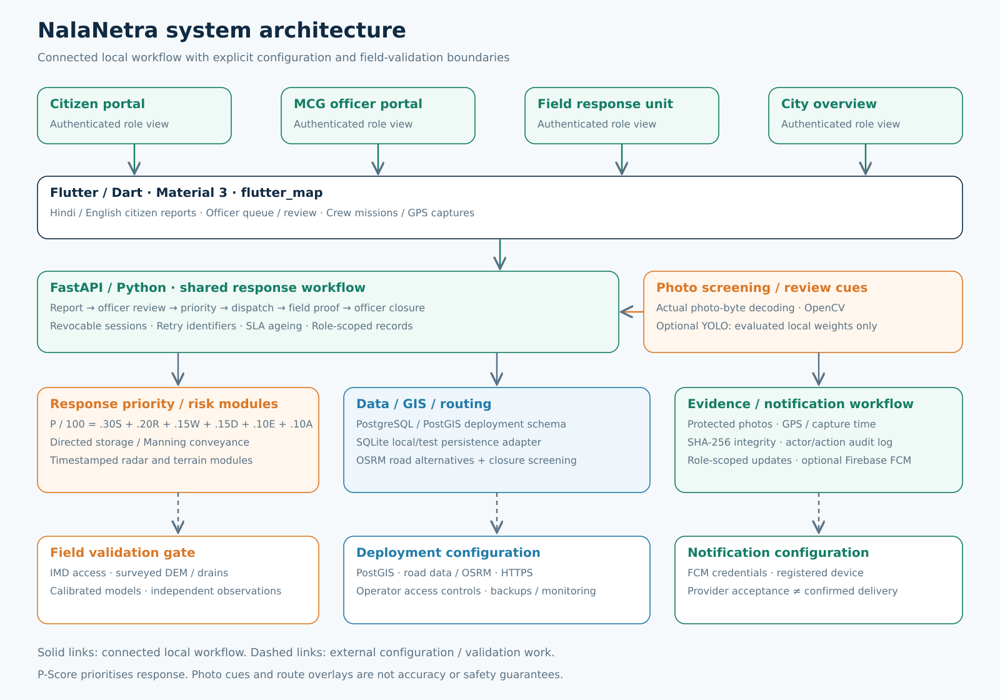
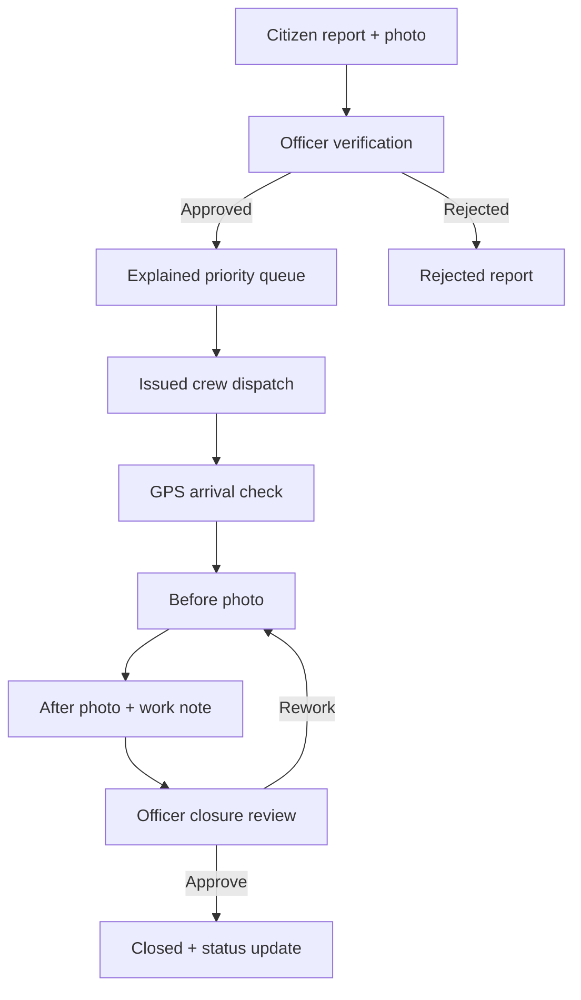

# NalaNetra system architecture

FastAPI owns canonical users, sessions, reports, incidents, jobs, evidence, audit and notification records. Flutter and the browser console share REST endpoints. SQLite provides persistent local use; deployment configuration requires PostgreSQL. The current map shows reported incident points; PostGIS schema supports spatial utilities.

State sequence: `SUBMITTED → VERIFIED → DISPATCHED → ON_SITE → WORK_IN_PROGRESS → AWAITING_REVIEW → CLOSED`. Rework returns to `WORK_IN_PROGRESS` and preserves evidence/audit history. A partial unique index enforces one active job per crew. PostgreSQL row locks protect retries and assignments; production throughput is not benchmarked.

## Intake, grouping and privacy

Citizen uploads carry original JPEG/PNG bytes, timestamp, depth tag, coordinates and source. The server decodes pixels, screens the photo, stores it privately and commits the database transaction before returning canonical IDs. Commit conflicts return an error and remove uncommitted files. A per-account retry ID prevents duplicate submission; conflicting evidence/coordinates are rejected.

A 150 m/six-hour candidate search presents nearby open reports. It is not DBSCAN or automatic obstruction equivalence. An officer explicitly merges candidates; higher severity requires another review. Citizen raw intake remains owner-scoped after merging; relevant crew proof is visible to affected reporters.

## Priority and risk

Six weights sum to one; each factor is bounded to 0–1. Responses expose contributions/source labels. Age uses server time; emergency context is a 0/1 factor. Deep-water escalation changes a response band separately from arithmetic. Unknown context is labelled explicitly.

Radar conversion checks freshness and returns null rainfall for stale/missing input. A live IMD feed is not connected. The drainage experiment uses directed storage transfers and Manning-limited capacity with nonnegative storage and mass balance. It has no reverse flow, 2D spread, surveyed street depths or local calibration. The terrain utility uses a small synthetic depression grid.

OpenCV derives a pixel colour cue. Optional YOLO requires evaluated local weights. Neither establishes calibrated depth or scene authenticity.

## Routing

Configured OSRM supplies alternatives and full road geometry. Every segment is checked against 150 m buffers around active waist/submerged reports, including potentially provisional depth claims. Failed, unconfigured or fully intersecting alternatives give no recommendation. This post-screening does not rewrite road graph weights or establish a dry route. Updated closures and surveyed polygons require operational inputs.

## Proof and closure

Crew arrival/proof belongs to the assigned account, with claimed accuracy ≤50 m and distance ≤50 m. Proof must follow dispatch and be within 15 minutes; after must follow before. Identical byte/pixel evidence is rejected. After proof carries a work note.

Closure rechecks stored SHA-256 values and needs an officer decision. Rework preserves old evidence; actors/times/transition/proof digests enter audit records. GPS/time are client assertions, not hardware attestation; database administrators can modify audit records.

Local browser fixtures use explicitly labelled `demo-fixture` coordinates, rejected in deployment mode. The browser demo is not evidence of physical GPS/camera validation.

## Sessions and updates

Passwords use salted scrypt. Short-lived JWTs reference persisted revocable sessions; hashed refresh tokens rotate. Signup only grants citizen access. Verified operator-issued staff IDs, login lockout and OTP expiry/attempt/resend limits are enforced.

Flutter secure storage holds account-scoped queue/session data. Native and browser protections differ; a trusted HTTPS origin and device review are necessary. Protected evidence requires authorization and no-store responses; account-specific image URLs avoid reuse across signed-in accounts.

Transitions persist role-scoped notifications. Optional FCM sending distinguishes configuration, provider acceptance and failure/retry status; automatic Flutter token enrollment and device delivery checks remain pending. See [security boundaries](../SECURITY.md).
