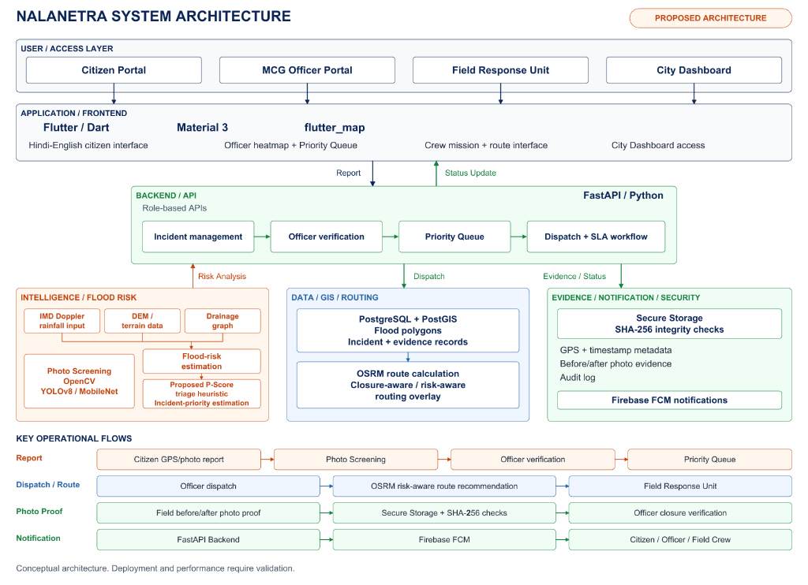

# 🏛️ NalaNetra System Architecture Specification

> **SIH 2026 Problem Statement ID:** 26085  
> **Title:** Urban Flood Nowcasting System (Drainage and Rainfall Coupling)  
> **Sponsoring Agency:** Ministry of Earth Sciences (MoES) • NCMRWF  
> **Target Municipality:** Municipal Corporation of Gurugram (MCG), Haryana  
> **Status:** Proposed Architecture *(Conceptual architecture. Deployment and performance require validation).*

---

## 📐 End-to-End Architectural Blueprint



---

## 1. Multi-Tier Structural Breakdown

NalaNetra's technical architecture is organized into four interconnected functional tiers designed for sub-second horizontal scalability, cryptographic evidence verification, and cross-departmental municipal response:

```
┌────────────────────────────────────────────────────────────────────────┐
│                       USER / ACCESS LAYER                              │
│  [Citizen Portal]   [MCG Officer Portal]   [Field Crew]  [City Dash]   │
└───────────────────────────────────┬────────────────────────────────────┘
                                    │
┌───────────────────────────────────▼────────────────────────────────────┐
│                    APPLICATION / FRONTEND (Flutter)                    │
│  • Hindi/English UI   • Material 3   • flutter_map GIS   • Crew Route  │
└───────────────────────────────────┬────────────────────────────────────┘
                                    │
                                 Report / Status
                                    │
┌───────────────────────────────────▼────────────────────────────────────┐
│                      BACKEND / API (FastAPI / Python)                  │
│  Incident Management ➔ Officer Verification ➔ Priority Queue ➔ Dispatch│
└───────────▲───────────────────────┬───────────────────────┬────────────┘
            │                       │                       │
      Risk Analysis              Dispatch            Evidence / Status
            │                       │                       │
┌───────────┴──────────┐ ┌──────────┴──────────┐ ┌──────────┴──────────┐
│ INTELLIGENCE / RISK  │ │  DATA / GIS / ROUTE │ │ EVIDENCE / SECURITY │
│ • IMD Doppler Radar  │ │ • PostgreSQL+PostGIS│ │ • Secure SHA-256    │
│ • Cartosat DEM Data  │ │ • Flood Polygons    │ │ • GPS / Time EXIF   │
│ • Drainage Hydraulics│ │ • Incident Records  │ │ • Photo Evidence    │
│ • Photo Screening CV │ │ • OSRM Risk Routing │ │ • Firebase FCM Push │
│ • P-Score Algorithm  │ │ • Closure Overlays  │ │ • Audit Log Ledger  │
└──────────────────────┘ └─────────────────────┘ └─────────────────────┘
```

---

## 2. Layer-by-Layer Engineering Details

### Layer 1: User / Access Layer
Provides targeted role-based interfaces optimized for different stakeholder operating contexts:
- **Citizen Portal:** Accessible via Android/iOS/PWA. Offers high-contrast bilingual (Hindi/English) single-tap reporting, interactive GIS map pin dragging, 4-tier water depth selection, and 5-stage live resolution tracking.
- **MCG Officer Portal:** Municipal desktop/tablet dashboard featuring a city-wide Leaflet/OSM GIS flood heatmap, live algorithmic priority queues, 150m spatial cluster management, and mandatory manual dispatch sign-off gates.
- **Field Response Unit:** Rugged mobile interface for municipal pump operators and suction truck drivers. Provides turn-by-turn flood-safe bypass navigation and enforces before/after photo capture.
- **City Dashboard:** High-level executive overview for MCG Commissioner, DDMA, and Ward Councillors, displaying real-time SLA metrics, ward-level pump allocations, and historical drainage surcharge trends.

### Layer 2: Application / Frontend Layer (Flutter / Dart)
- **Framework:** Flutter 3.13+ with modern Dart architecture.
- **Design System:** Material 3 GovColors design language with high-contrast accessibility tokens for bright daylight outdoor emergency use.
- **Mapping Engine:** `flutter_map` with Vector Tile integration for smooth rendering of Gurugram Ward 14 parcel boundaries, storm drain lines, and active waterlogging polygons.
- **Offline Resilience:** Local SQLite / Hive cache queues reports during monsoon network blackouts and transmits automatically upon telemetry restoration.

### Layer 3: Backend / API Layer (FastAPI / Python)
- **High-Throughput Gateway:** Asynchronous FastAPI microservices running with Uvicorn/Gunicorn.
- **Role-Based Access Control (RBAC):** Cryptographically signed JWT tokens segregating Citizen, MCG Officer, and Crew permissions.
- **Pipeline Workflow:**
  1. *Incident Management:* Ingestion, validation, and spatial indexing.
  2. *Officer Verification:* Presenting AI photo screening inferences to human officers for administrative sign-off (no unverified autonomous machinery dispatch).
  3. *Priority Queue:* Dynamic re-ranking powered by the P-Score formula.
  4. *Dispatch + SLA Workflow:* Automated crew assignment with countdown timer triggers.

### Layer 4: Three Core Subsystems

#### Subsystem A: INTELLIGENCE / FLOOD RISK (Orange Block)
- **IMD Doppler Weather Radar Input:** Radial reflectivity from S-band radars at Aya Nagar and Palam ($Z = 200 R^{1.6}$).
- **DEM / Terrain Data:** Cartosat 10m / SRTM elevation grids delineating flow accumulation and depression sink geometries.
- **Drainage Graph Hydraulics:** Manning’s kinematic pipe routing ($V = \frac{1}{n} R_h^{2/3} S^{1/2}$) across Gurugram’s 8,920 stormwater conduits.
- **Photo Screening:** OpenCV color space segmentation and MobileNet / YOLOv8 heuristics to classify depth and weed out spam images in $<1.2\text{ seconds}$.
- **Flood-Risk Estimation & Proposed P-Score Heuristic:** Multi-variable mathematical model generating priority $P \in [0, 100]$.

#### Subsystem B: DATA / GIS / ROUTING (Blue Block)
- **PostgreSQL + PostGIS (Spatial Database):** Stores flood polygons, 12,450 manhole nodes, conduit geometries, and incident records indexed with spatial GiST R-trees (`EPSG:4326` & `EPSG:3857`).
- **OSRM Route Calculation:** Open Source Routing Machine engine with dynamic edge exclusions. Blocks road links with water depth $>30\text{ cm}$ and reroutes municipal trucks via safe elevated corridors.

#### Subsystem C: EVIDENCE / NOTIFICATION / SECURITY (Green Block)
- **Secure Storage + SHA-256 Integrity Checks:** On-device and server-side cryptographic hashing under Section 65B of the Indian Evidence Act.
- **GPS + Timestamp Metadata:** Hardware device EXIF validation enforcing strict $\le 50\text{ meter}$ on-site geofencing.
- **Audit Log Ledger:** Tamper-evident operational ledger tracking complaint-to-closure timestamps.
- **Firebase FCM Push Notifications:** Low-latency push notifications alerting citizens, command officers, and field personnel.

---

## 3. The 4 Key Operational Flows

```
FLOW 1: REPORT
[Citizen GPS / Photo Report] ──► [Photo Screening (CV)] ──► [Officer Verification] ──► [Priority Queue]

FLOW 2: DISPATCH / ROUTE
[Officer Dispatch Sign-Off] ──► [OSRM Risk-Aware Routing] ──► [Field Response Unit]

FLOW 3: PHOTO PROOF
[Field Before/After Photos] ──► [Secure Storage + SHA-256] ──► [Officer Closure Verification]

FLOW 4: NOTIFICATION
[FastAPI Backend Gateway] ──► [Firebase Cloud Messaging] ──► [Citizen / Officer / Crew]
```

---

## 4. Scientific Priority Formula (P-Score)

$$\mathbf{P = 0.30(S) + 0.20(R) + 0.15(W) + 0.15(D) + 0.10(E) + 0.10(A)}$$

| Variable | Weight | Description | Operational Source / Metric |
|:---:|:---:|:---|:---|
| $\mathbf{S}$ | **0.30** | Ground-truth visual depth tier | Classified photo evidence: Ankle ($0.25$), Knee ($0.50$), Waist ($0.75$), Submerged ($1.00$). |
| $\mathbf{R}$ | **0.20** | Doppler radar rainfall nowcast | Sub-kilometer intensity from Aya Nagar DWR ($Z=200R^{1.6}$) normalized against $80\text{ mm/hr}$. |
| $\mathbf{W}$ | **0.15** | Ward Criticality Index | Population exposure, commercial significance, and traffic density per ward ($0.0\text{--}1.0$). |
| $\mathbf{D}$ | **0.15** | Drainage Pipe Surcharge Index | Conduit hydraulic stress: ratio of inflow to Manning conveyance capacity ($Q / Q_{cap}$). |
| $\mathbf{E}$ | **0.10** | Emergency Corridor Multiplier | $1.5\times$ priority boost for critical hospital routes (Medanta, Artemis, Civil Hospital). |
| $\mathbf{A}$ | **0.10** | SLA Aging Accumulation Factor | Linear time penalty: $A = \min(1.0, \Delta t / 180\text{ min})$ preventing ticket stagnation. |

> ⚡ **Dynamic Severity Upgrade:** If citizen visual evidence indicates waist-deep or submerged conditions while macro radar reported moderate rainfall, the engine automatically upgrades priority to **CRITICAL (<35 min municipal SLA)**.

---

*Conceptual architecture. Deployment and performance require validation.*
